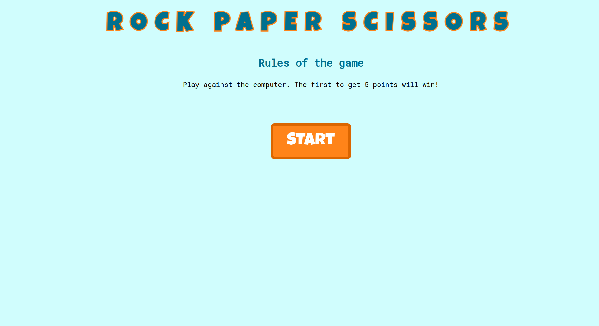
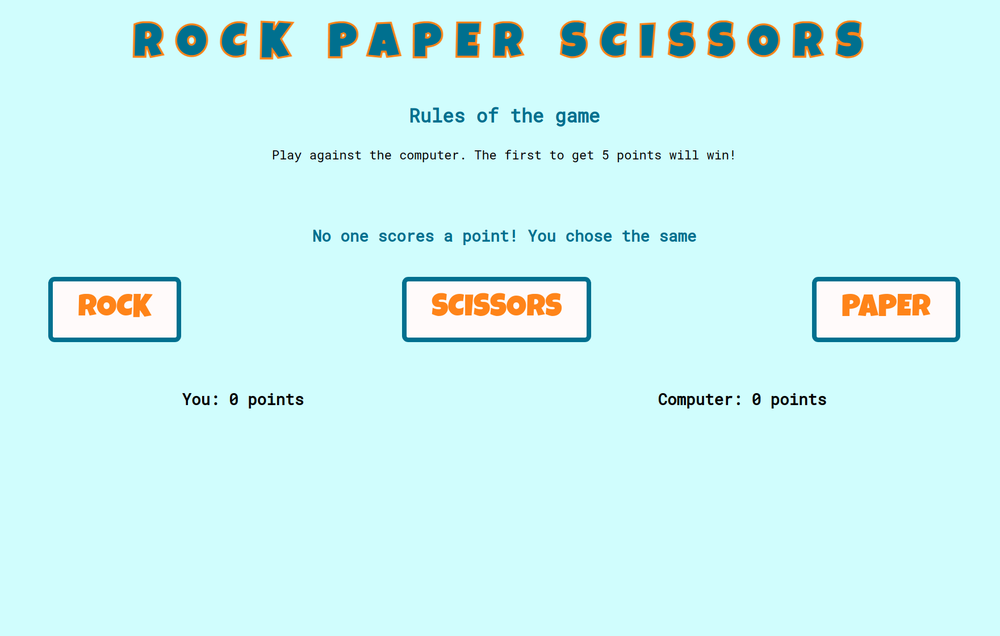

# rock-paper-scissors
Using HTML, CSS and Javascript to create a rock paper scissors game. The winner is determined by whoever reaches 5 points first, and an option at the end to restart the game 

